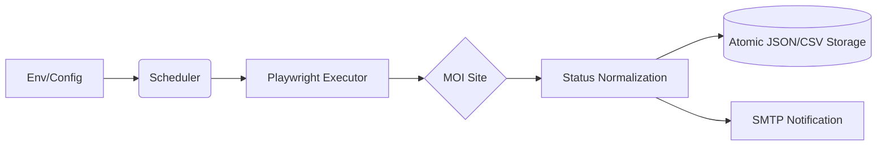
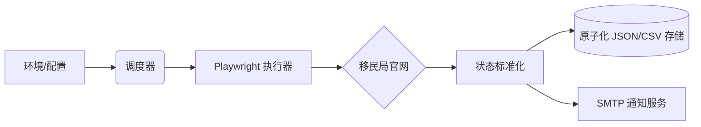

<div align="center">

# 🇨🇿 CZ Visa Status Monitor

[](https://www.python.org/)
[](https://opensource.org/licenses/MIT)
[](docker-compose.yml)
[](#-sre-hardening-features)
[](https://github.com/astral-sh/ruff)

**A robust automated monitoring system for Czech visa applications, featuring multi-user support, real-time alerts, and anti-ban protection.**  
**全自动捷克签证状态监控系统：支持多用户管理、实时邮件提醒、自动化防封禁与极致稳定性。**

[English](#english) | [中文说明](#中文)

</div>

---

<a name="english"></a>

## 🌟 English Edition

### 1. Introduction
**CZ Visa Status Monitor** solves the pain of manually checking the Czech Ministry of Interior (MOI) website. It automatically tracks visa application statuses, sends instant notifications when changes occur, and manages sessions efficiently to avoid IP bans.

### 2. Key Features
- **🛡️ SRE Hardened**: Atomic writes with `.bak` backups, automatic zombie process reaping, and stable hot-reloading.
- **⚡ Async Engine**: High-concurrency Playwright-based query dispatcher.
- **📧 Smart Alerts**: Business-priority email delivery (OTP first) with SMTP connection pooling.
- **🐳 Multi-Platform**: Native support for Docker, Systemd, and Raw Python orchestration.

### 3. Data Configuration (Crucial!)
Before starting, you must tell the system which codes to monitor.

#### A. Input Codes (`query_codes.csv`)
Used for batch queries or initialization. Place it in the root or specified path.
```csv
Date/日期,查询码/Code,Status/签证状态
2025-06-02,PEKI202506020001,
2025-06-03,PEKI202506030002,
```

#### B. User Managed Codes (`site/config/users.json`)
Managed automatically via Web interface or manual entry for notification targets.
```json
{
  "codes": {
    "PEKI202506020001": {
      "code": "PEKI202506020001",
      "target": "user@example.com",
      "channel": "email",
      "freq_minutes": 60
    }
  }
}
```

### 4. Installation & Deployment

#### 🐳 via Docker (Recommended)
1.  **Prep**: `cp .env.example .env` and edit your SMTP/Settings.
2.  **Launch**: `docker-compose up -d`
3.  **Logs**: `docker logs -f cz-visa-monitor`

#### 🎮 via CLI (Python)
1.  **Dependencies**: `pip install -r requirements.txt && playwright install chromium`
2.  **Monitor**: `python visa_status.py monitor -e .env`
3.  **Report**: `python visa_status.py report`

#### 🖥️ via Systemd
1.  Customize `deployment/cz-visa-monitor.service` paths.
2.  `sudo python visa_status.py monitor --install -e /absolute/path/.env`
3.  `sudo systemctl start cz-visa-monitor`

### 5. Configuration (.env)
| Group | Variable | Description | Default |
| :--- | :--- | :--- | :--- |
| **Engine** | `WORKERS` | Max concurrent browser pages | `1` |
| **Engine** | `HEADLESS` | Run Chromium without GUI | `true` |
| **Task** | `DEFAULT_FREQ_MINUTES` | Check interval if not specified per code | `60` |
| **Email** | `SMTP_HOST` | Your email provider SMTP server | - |
| **Email** | `EMAIL_MAX_PER_MINUTE` | Prevention of SMTP spam blocking | `10` |

### 6. Command Reference
| Command | Alias | Description |
| :--- | :--- | :--- |
| `gen` | `gc` | Intelligent batch code generator with date ranges. |
| `monitor` | `m` | Start the daemon for continuous tracking. |
| `report` | `r` | Compile Markdown summaries & visualization charts. |
| `cz` | `c` | One-time synchronous query for a CSV file. |

### 7. Architecture


---

<a name="中文"></a>

## 🌟 中文说明

### 1. 项目简介
**CZ Visa Status Monitor** 解决了手动刷新捷克移民局官网的痛苦。它能够全自动追踪签证申请状态，在状态发生变更时立即发送通知，并通过高效的会话管理防止 IP 被封禁。

### 2. 核心特性
- **🛡️ SRE 级加固**: 原子化写入与 `.bak` 逻辑备份、僵尸进程自动回收、稳定的配置热重载。
- **⚡ 异步引擎**: 基于 Playwright 的高并发查询分发器。
- **📧 智能提醒**: 业务优先级邮件分发（验证码优先），内置 SMTP 连接池。
- **🐳 多平台支持**: 原生支持 Docker、Systemd 以及裸机 Python 环境。

### 3. 数据配置 (关键步骤!)
在启动之前，您需要告知系统需要监控哪些申请码。

#### A. 批量输入 (`query_codes.csv`)
用于批量查询或系统初始化。
```csv
日期/Date,查询码/Code,签证状态/Status
2025-06-02,PEKI202506020001,
2025-06-03,PEKI202506030002,
```

#### B. 用户管理配置 (`site/config/users.json`)
通过 Web 界面或手动编辑，用于配置通知目标。
```json
{
  "codes": {
    "PEKI202506020001": {
      "code": "PEKI202506020001",
      "target": "user@example.com",
      "channel": "email",
      "freq_minutes": 60
    }
  }
}
```

### 4. 安装与部署

#### 🐳 通过 Docker 部署 (推荐)
1.  **准备**: `cp .env.example .env` 并编辑您的 SMTP 与基础设置。
2.  **启动**: `docker-compose up -d`
3.  **日志**: `docker logs -f cz-visa-monitor`

#### 🎮 通过 命令行 (Python)
1.  **依赖**: `pip install -r requirements.txt && playwright install chromium`
2.  **监控**: `python visa_status.py monitor -e .env`
3.  **报告**: `python visa_status.py report`

#### 🖥️ 通过 Systemd 托管
1.  根据实际路径修改 `deployment/cz-visa-monitor.service`。
2.  安装：`sudo python visa_status.py monitor --install -e /绝对路径/.env`
3.  启动：`sudo systemctl start cz-visa-monitor`

### 5. 配置说明 (.env)
| 分组 | 变量名 | 描述 | 默认值 |
| :--- | :--- | :--- | :--- |
| **引擎** | `WORKERS` | 最大并发浏览器页面数 | `1` |
| **引擎** | `HEADLESS` | 是否以无界面模式运行 Chromium | `true` |
| **任务** | `DEFAULT_FREQ_MINUTES` | 默认监控频率 | `60` |
| **邮件** | `SMTP_HOST` | 邮件服务商的 SMTP 地址 | - |
| **邮件** | `EMAIL_MAX_PER_MINUTE` | 防止被封禁的单位时间发信限额 | `10` |

### 6. 指令参考
| 指令 | 别名 | 描述 |
| :--- | :--- | :--- |
| `gen` | `gc` | 基于日期范围智能生成批量查询码。 |
| `monitor` | `m` | 启动守护进程进行持续追踪。 |
| `report` | `r` | 汇总生成 Markdown 报告与可视化图表。 |
| `cz` | `c` | 对指定 CSV 文件进行单次同步查询。 |

### 7. 系统架构


---
<div align="center">
Developed with ❤️ for the CZ Visa Community.
</div>


