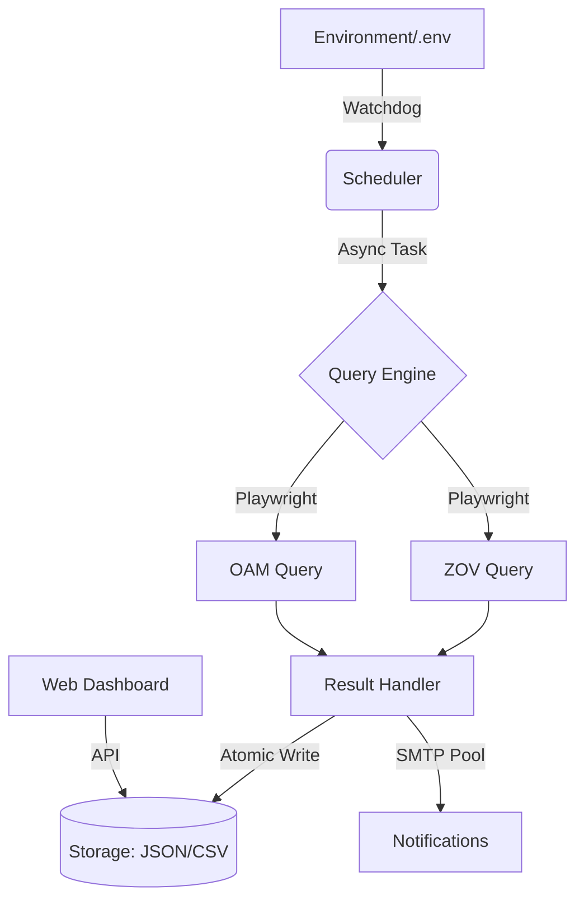

<div align="center">

# 🇨🇿 CZ Visa Status Monitor

[](https://www.python.org/)
[](https://opensource.org/licenses/MIT)
[](docker-compose.yml)
[](#-technical-highlights)
[](https://github.com/astral-sh/ruff)

**Robust and reliable automated monitoring system for Czech visa applications.**  
**高效可靠的捷克签证申请状态自动监控系统 - 极致健壮，生产就绪。**

[English](#english-version) | [中文说明](#中文版)

</div>

---

<a name="english-version"></a>

## 🌟 Overview

**CZ Visa Status Monitor** is a robust, asynchronous monitoring solution designed for individuals and agencies to track Czech visa application statuses in real-time. Built with a focus on **Site Reliability Engineering (SRE)**, it guarantees data integrity, resource efficiency, and high availability.

### 🚀 Key Features

*   🛡️ **SRE Hardened**: Features atomic write-ahead logging (WAL), automatic `.bak` disaster recovery, and aggressive Playwright zombie process reaping.
*   ⚡ **High Performance**: Asynchronous query engine based on Playwright/Asyncio with configurable concurrency and rate limiting.
*   🐳 **Cloud Ready**: One-click deployment via Docker Compose or native Systemd integration.
*   🔄 **Hot Reload**: Real-time configuration updates via `.env` without interrupting active monitoring tasks.
*   📧 **Smart Alerts**: Advanced email notification system with SMTP connection pooling and business-priority verification codes.
*   🧱 **DRY Architecture**: Minimalist codebase using Python decorators and unified file I/O abstractions.

---

## 🏗️ Architecture



---

## 🛠️ Quick Start

### Option 1: Docker (Recommended) 🐳
The fastest way to get up and running with all dependencies pre-configured.

```bash
# 1. Clone the repository
git clone https://github.com/yuanweize/Czech-Visa-Application-Status-Check.git
cd Czech-Visa-Application-Status-Check

# 2. Configure environment
cp .env.example .env

# 3. Launch
docker-compose up -d
```

### Option 2: Bare Metal 🐍
Ensure you have Python 3.10+ installed.

```bash
# Install dependencies
pip install -r requirements.txt
playwright install chromium

# Run monitor
python visa_status.py monitor -e .env
```

---

## ⚙️ Configuration

Key settings in your `.env` file:

| Variable | Description | Default |
| :--- | :--- | :--- |
| `HEADLESS` | Run browser without UI | `true` |
| `WORKERS` | Concurrent browser pages | `1` |
| `DEFAULT_FREQ_MINUTES` | Global monitoring interval | `60` |
| `EMAIL_MAX_PER_MINUTE` | SMTP Rate limiting | `10` |

---

<a name="中文版"></a>

## 🌟 项目简介

**CZ Visa Status Monitor** 是一款专为捷克签证申请设计的自动化监控系统。本项目不仅仅是一个查询工具，更是一个遵循 **SRE (站点可靠性工程)** 原则构建的生产级服务，旨在通过技术手段确保查询的及时性、数据的完整性与系统的稳定性。

### 🚀 技术亮点

*   🛡️ **极致健壮性**: 引入 **原子化写入 (Atomic Writes)** 机制与自动 `.bak` 备份，从根源上杜绝因断电或系统崩溃导致的数据丢失风险。
*   ⚡ **高效调度**: 基于 Playwright + Asyncio 的非阻塞查询引擎，支持数平级并发。
*   🐳 **运维就绪**: 完美支持 Docker Compose 一键部署及 Systemd 常驻进程托管。
*   🔄 **热重载系统**: 配置变更无需重启，调度中心自动同步最新环境参数。
*   📧 **智能通知**: 具备 SMTP 连接池管理与邮件指纹去重功能，验证码邮件享受极速绿色通道。

---

## 📦 部署指南

### 方式一：Docker 部署 (强烈推荐) 🐳
环境隔离，一键启动，数据持久化。

```bash
git clone https://github.com/yuanweize/Czech-Visa-Application-Status-Check.git
cd Czech-Visa-Application-Status-Check
cp .env.example .env
docker-compose up -d
```
*挂载说明：日志 (`logs/`)、数据 (`data/`) 及配置文件 (`config/`) 均自动映射至宿主机。*

### 方式二：Systemd 原生托管 🖥️
适用于 Linux 服务器长期运行。

1.  修改 `deployment/cz-visa-monitor.service` 中的路径。
2.  执行安装：
    ```bash
    sudo python visa_status.py monitor --install -e /path/to/.env
    sudo systemctl start cz-visa-monitor
    ```

---

## 🛠️ 核心指令

| 命令 | 描述 |
| :--- | :--- |
| `python visa_status.py gen` | 智能批量生成签证查询码 |
| `python visa_status.py monitor` | 启动自动化监控守护进程 |
| `python visa_status.py report` | 生成可视化 Markdown 监控报告 |

---

## 🛡️ SRE 硬核加固说明

本项目在多次迭代中完成了“从功能到工程”的进化：
*   **资源闭环**: 实现了 `force_cleanup_all` 机制，强制回收所有 Playwright 上下文，彻底告别内存溢出与僵尸进程。
*   **数据韧性**: 采用 `Temporary File -> os.replace` 策略，确保文件写入要么成功，要么保持原样。
*   **代码解耦**: 采用统一的 `file_ops` 抽象层与 `@synchronized` 装饰器，遵循 DRY 原则，让代码更纯粹、更易于审计。

---

## 🔗 相关链接

- **问题反馈**: [Opening an issue](https://github.com/yuanweize/Czech-Visa-Application-Status-Check/issues)
- **许可证**: [MIT License](LICENSE)

---
<div align="center">
Developed with ❤️ for the CZ Visa Community.
</div>


