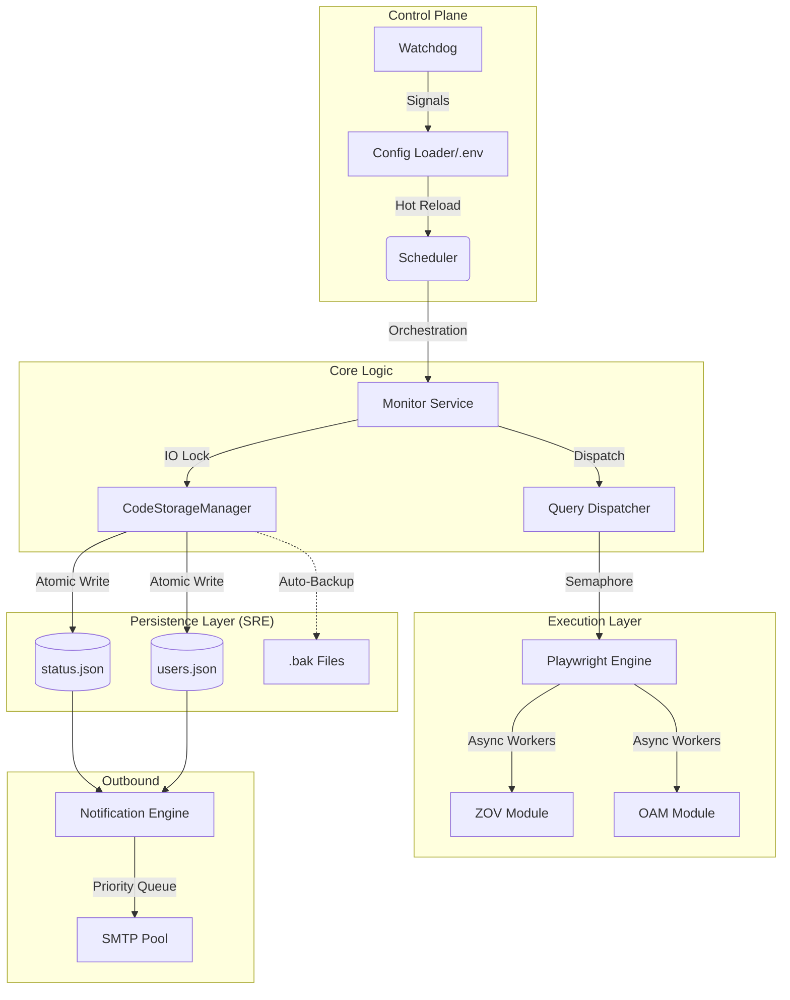
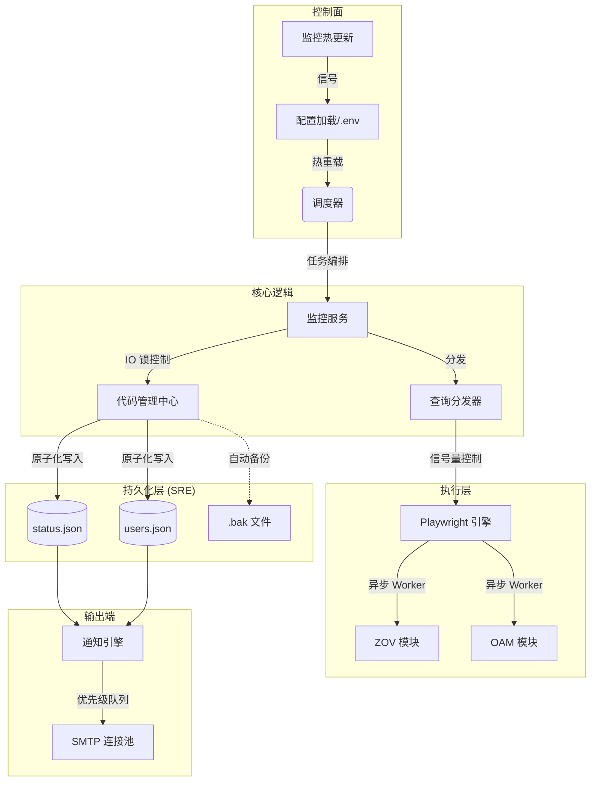

<div align="center">

# 🇨🇿 CZ Visa Status Monitor

[](https://www.python.org/)
[](https://opensource.org/licenses/MIT)
[](docker-compose.yml)
[](#-sre-compliance--safety)
[](https://github.com/astral-sh/ruff)
[](https://coderabbit.ai)

**A high-availability, automated monitoring solution for Czech visa applications.**  
**高效、稳健的捷克签证申请状态自动化监控解决方案。**

[English](#english) | [中文说明](#中文)

</div>

---

<a name="english"></a>

## 🌟 English Edition

### 1. Overview
**CZ Visa Status Monitor** is designed for individuals and agencies of all sizes. It automates the tedious task of monitoring the Czech Ministry of Interior (MOI) application statuses. The system handles everything from automated queries via Playwright to multi-channel notifications and multi-user management.

### 2. System Architecture
The system is built on a decoupled, asynchronous reactor pattern to ensure maximum scalability and fault tolerance.

#### 🧩 Component Map


#### 🔄 Internal Data Flow
1.  **Ingestion**: Configuration is loaded from `.env` or matched from `query_codes.csv`.
2.  **Scheduling**: The `Scheduler` generates periodic check-points for each code based on `DEFAULT_FREQ_MINUTES`.
3.  **Execution**: `Playwright` instances are launched with resource-blocking (no images/fonts) to save bandwidth.
4.  **SRE Storage**: Results are written using the **Atomic Write-Ahead** pattern to prevent data corruption.
5.  **Alerting**: The `Notification Engine` deduplicates events and pushes unique status changes to users via the SMTP pool.

### 3. Data Configuration
You must configure your monitoring targets in one of the following ways:

#### A. Static Batch (`query_codes.csv`)
Best for one-time checks or initial baseline.
- **Path**: Root directory.
- **Format**: `Date,Code,Status` (Header is required).

#### B. Dynamic Multi-User (`site/config/users.json`)
Managed automatically via Web UI, but can be manually edited.
```json
{
  "codes": {
    "PEKI202506020001": {
      "target": "user@example.com",
      "freq_minutes": 30,
      "note": "Work Permit"
    }
  }
}
```

### 4. Deployment Manual

#### 🐳 Docker Compose (Production Ready)
```bash
# 1. Setup config
cp .env.example .env && vi .env

# 2. Start container
docker-compose up -d

# 3. View real-time logs
docker logs -f cz-visa-monitor
```

#### 🐍 Bare Metal / Python
```bash
# Setup environment
pip install -r requirements.txt
playwright install chromium

# Launch as a daemon
python visa_status.py monitor -e .env
```

#### 🖥️ Systemd (Linux Service)
1. Edit `deployment/cz-visa-monitor.service` with your absolute paths.
2. Link the service: `sudo ln -s $(pwd)/deployment/cz-visa-monitor.service /etc/systemd/system/`
3. Reload & Start: `sudo systemctl daemon-reload && sudo systemctl enable --now cz-visa-monitor`

### 5. SRE Compliance & Safety
Built for long-term stability:
- **Zero-Trust Persistence**: Every write operation uses `tempfile` + `os.replace` to ensure zero file truncation risk.
- **Resource Closed-Loop**: Global `Context` tracking ensures 100% reclamation of Chromium processes, even on catastrophic failure.
- **Rate Limit Resilience**: SMTP flow control (e.g., 10 emails/min) and business-level deduplication prevent IP/Account blacklisting.

---

<a name="中文"></a>

## 🌟 中文说明

### 1. 项目概览
**CZ Visa Status Monitor** 专为个人及代理机构设计，旨在彻底自动化监控捷克移民局 (MOI) 申请状态这一繁琐任务。系统涵盖了从基于 Playwright 的自动化查询、多渠道通知、到支持多用户的 Web 管理全流程。

### 2. 系统架构
系统采用解耦的、异步反应堆模式构建，以确保最大的可扩展性与容错能力。

#### 🧩 组件图谱


#### 🔄 内部数据流
1.  **接入**: 系统从 `.env` 加载基础配置，或从 `query_codes.csv` 匹配初始查询码。
2.  **调度**: `调度器` 根据 `DEFAULT_FREQ_MINUTES` 为每个代码生成周期性的检查时间点。
3.  **执行**: `Playwright` 启动时自动屏蔽流量消耗（如图像/字体），仅抓取核心状态数据。
4.  **持久化**: 结果通过 **原子替换 (Atomic Replace)** 模式写入磁盘，防止在写入过程中断电导致的文件损坏。
5.  **预警**: `通知引擎` 对事件进行去重，通过 SMTP 连接池将唯一的状态变更即时推送至用户。

### 3. 数据配置指导
您可以通过以下两种方式之一配置监控目标：

#### A. 静态批量 (`query_codes.csv`)
适用于一次性大批量查询或初始数据导入。
- **路径**: 项目根目录。
- **格式**: `Date,Code,Status` (必须包含表头)。

#### B. 动态多用户 (`site/config/users.json`)
通过 Web 界面自动管理，也支持手动编辑配置通知目标。
```json
{
  "codes": {
    "PEKI202506020001": {
      "target": "user@example.com",
      "freq_minutes": 30,
      "note": "工作签证"
    }
  }
}
```

### 4. 部署手册

#### 🐳 Docker Compose (生产就绪)
```bash
# 1. 设置配置
cp .env.example .env && vi .env

# 2. 启动容器
docker-compose up -d

# 3. 查看实时日志
docker logs -f cz-visa-monitor
```

#### 🐍 裸机 / Python 环境
```bash
# 安装依赖
pip install -r requirements.txt
playwright install chromium

# 作为后台守护进程运行
python visa_status.py monitor -e .env
```

#### 🖥️ Systemd (Linux 服务托管)
1. 修改 `deployment/cz-visa-monitor.service` 中的绝对路径。
2. 软链接服务：`sudo ln -s $(pwd)/deployment/cz-visa-monitor.service /etc/systemd/system/`
3. 重载并启动：`sudo systemctl daemon-reload && sudo systemctl enable --now cz-visa-monitor`

### 5. SRE 合规与安全性
专为长期稳定运行而设计：
- **零信任持久化**: 每次写入操作均遵循 `临时文件 -> os.replace` 流程，确保文件绝不会出现“半截”或 0 字节损坏。
- **资源闭锁**: 全局 Context 追踪确保在任何灾难性故障下，Chromium 进程都能被 100% 回收。
- **频率限制韧性**: 实施 SMTP 流量控制（如 10 封/分钟）与业务层去重，防止 IP 或发信账号被拉黑。

---

### 📧 Intelligent Notification System (LKVS)
To prevent spam during network fluctuations, the system implements a **Last Known Valid Status (LKVS)** mechanism:
1. **Transient Failure Suppression**: If a query fails ("Query Failed"), no notification is sent.
2. **State Recovery**: When recovering from a failure, the new status is compared against the *Last Known Valid Status*, not the failure state.
   - `Proceedings` -> `Query Failed` -> `Proceedings`: **No Email** (Recovered)
   - `Proceedings` -> `Query Failed` -> `Granted`: **Email Sent** (Real Change)
